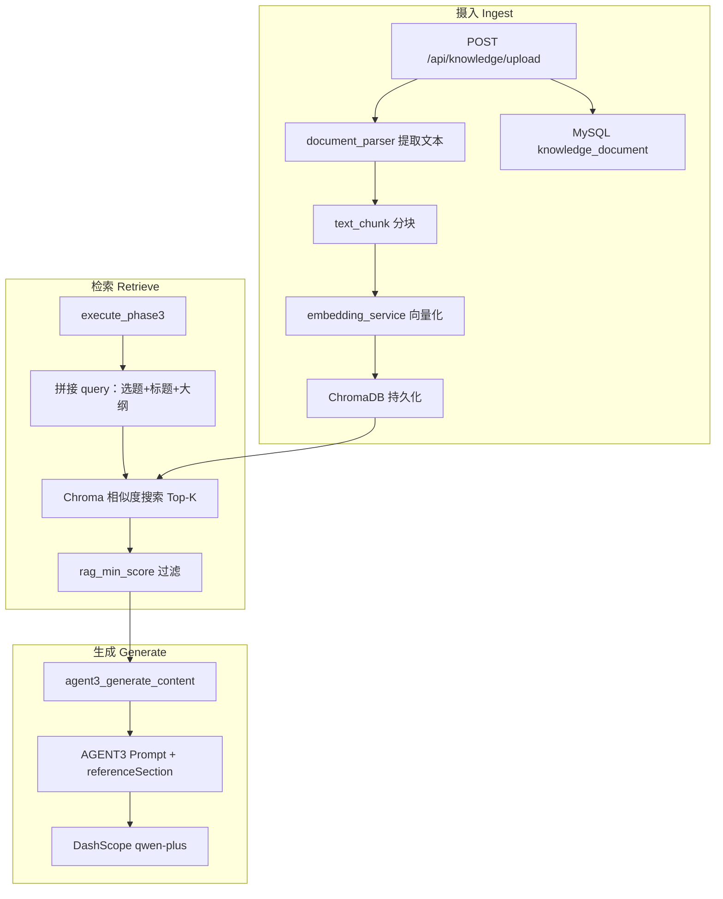

# RAG 系统知识库实现说明

本文档说明本项目 **系统级知识库 + RAG（检索增强生成）** 的设计与实现，便于开发、运维与验证。

---

## 1. 是什么、解决什么问题

**RAG（Retrieval-Augmented Generation）**：在调用大模型写正文之前，先从知识库中 **检索** 与当前文章最相关的文本片段，作为 **参考资料** 注入 Prompt，使生成内容更贴近事实、减少胡编。

在本项目中：

| 项目 | 说明 |
|------|------|
| 知识来源 | **系统级**知识库，管理员上传，所有用户共享 |
| 注入阶段 | **仅阶段 3**（Agent3 生成正文），标题/大纲/配图不走 RAG |
| 产品形态 | **新媒体长文创作**（1800～2600 字），不是问答机器人 |

---

## 2. 整体架构

```
管理员上传文档
    → 解析文本 → 分块 → DashScope Embedding → 写入 ChromaDB
    → MySQL 记录元数据（标题、状态、分块数）

用户确认大纲 → 阶段 3 开始
    → 用「选题 + 标题 + 大纲」检索 ChromaDB（Top-K）
    → 过滤低分片段 → 拼成参考资料段
    → 注入 Agent3 Prompt → qwen-plus 流式写正文
```



---

## 3. 存储设计

| 存储 | 路径/表 | 内容 |
|------|---------|------|
| MySQL | `knowledge_document` | 文档标题、文件名、类型、大小、状态、`chunkCount`、错误信息 |
| ChromaDB | `./data/chroma`（可配置） | 每块的 **向量 + 原文 + metadata** |
| 磁盘 | `./data/knowledge_files` | 原始 `.txt/.md/.docx`，用于重建索引 |

**不在 MySQL 存 embedding**，避免表膨胀。删除文档时同步删除 Chroma 中对应 `document_id` 的向量。

数据库迁移脚本：`python-backend/sql/migrate_knowledge_rag.sql`

---

## 4. 摄入流程（Ingest）

**入口**：管理员 → 前端「知识库」页 → `POST /api/knowledge/upload`

**调用链**：

```
knowledge.py
  → KnowledgeService.create_and_ingest
  → KnowledgeIngestService.ingest_file
```

### 4.1 支持的文件格式

| 格式 | 处理方式 |
|------|----------|
| `.txt` / `.md` | UTF-8 解码 |
| `.docx` | `python-docx` 提取段落与表格文字 |
| `.doc` | 不支持，需另存为 `.docx` |

实现：`app/utils/document_parser.py`

### 4.2 分块（Chunking）

- 默认块大小 **600 字符**，重叠 **80 字符**
- 优先按 **段落** 切分，超长段落再滑动窗口

实现：`app/utils/text_chunk.py`

### 4.3 向量化（Embedding）

- API：DashScope OpenAI 兼容 `embeddings.create`
- 模型：默认 `text-embedding-v3`
- 与 Chat **共用** `DASHSCOPE_API_KEY`，但是 **不同接口**
- 单次 batch **最多 10 条**（阿里云限制）

实现：`app/services/embedding_service.py`

### 4.4 写入向量库

- Collection：`system_knowledge`
- 距离度量：`cosine`
- 每条 metadata：`document_id`、`chunk_index`、`title`

实现：`app/managers/chroma_manager.py`

上传成功后 MySQL 状态为 `ready`，`chunkCount > 0`。

---

## 5. 检索流程（Retrieve）

**触发时机**：用户确认大纲后，`execute_phase3` → **仅** `agent3_generate_content` 执行前。

**调用链**：

```
article_agent_service.agent3_generate_content
  → retrieval_service.retrieve_for_article
  → embedding_service.embed_query
  → chroma_manager.query
  → _format_result（过滤 + 格式化）
```

### 5.1 检索 Query 如何构造

将以下内容拼成一段文本（截断至 **500 字**）：

```
选题：{topic}
主标题：{mainTitle}
副标题：{subTitle}
章节1：{title}（{points}）
章节2：...
```

**注意**：不是只用用户选题，而是 **选题 + 已选标题 + 已确认大纲** 共同参与检索。

### 5.2 相似度与过滤

- 取 Top-K（默认 **5**）个 chunk
- `score = 1 - distance`（cosine 空间）
- **`score < RAG_MIN_SCORE`（默认 0.35）** 的块丢弃
- 若全部被过滤 → `retrievalHitCount = 0`，**不注入**参考资料

### 5.3 格式化输出示例

注入 Prompt 前的参考资料形如：

```text
【参考资料1】来源：《产品手册.docx》
......chunk 原文......

【参考资料2】来源：《行业报告.md》
......chunk 原文......
```

---

## 6. 生成流程（Augment + Generate）

Prompt 模板：`app/constants/prompt.py`

- `AGENT3_CONTENT_PROMPT` 在大纲 `{outline}` 之后预留 `{referenceSection}`
- 有检索命中时插入 `AGENT3_REFERENCE_SECTION` + 参考资料正文
- 无命中时 `{referenceSection}` 为空字符串

写作要求中约定：若提供了参考资料，涉及事实、数据、专有名词时 **优先依据资料**。

Agent3 仍按大纲写 **1800～2600 字 Markdown 长文**（流式 SSE：`AGENT3_STREAMING`），**不是**直接问答。

实现：`app/services/article_agent_service.py` → `agent3_generate_content`

日志字段（`agent_log.inputData`）：

- `retrievalHitCount`：命中条数
- `retrievalSources`：`documentId`、`title`、`chunkIndex`、`score`

---

## 7. API 与前端

### 7.1 后端 API（均需管理员）

| 接口 | 说明 |
|------|------|
| `POST /api/knowledge/upload` | 上传并建立索引（multipart：file + 可选 title） |
| `POST /api/knowledge/list/page` | 分页列表 |
| `GET /api/knowledge/{id}` | 文档详情 |
| `POST /api/knowledge/delete` | 软删 + 清理 Chroma 向量 |
| `POST /api/knowledge/reindex/{id}` | 从磁盘原文件重建索引 |

路由：`app/routers/knowledge.py`

### 7.2 前端

- 页面：`frontend/src/pages/admin/KnowledgeManagePage.vue`
- 路由：`/admin/knowledge`
- API 封装：`frontend/src/api/knowledge.ts`
- 导航：管理员菜单「知识库」

普通用户 **创作页无需改动**；阶段 3 在 `RAG_ENABLED=true` 时自动检索。

---

## 8. 配置项（`.env`）

| 变量 | 默认值 | 说明 |
|------|--------|------|
| `RAG_ENABLED` | `true` | 总开关，`false` 时与未接入 RAG 行为一致 |
| `DASHSCOPE_EMBEDDING_MODEL` | `text-embedding-v3` | Embedding 模型 |
| `RAG_TOP_K` | `5` | 检索返回的最大 chunk 数 |
| `RAG_CHUNK_SIZE` | `600` | 分块字符数 |
| `RAG_CHUNK_OVERLAP` | `80` | 块重叠字符数 |
| `RAG_MIN_SCORE` | `0.35` | 相似度阈值，低于则丢弃 |
| `RAG_EMBED_BATCH_SIZE` | `10` | Embedding 批大小（≤10） |
| `CHROMA_PERSIST_DIR` | `./data/chroma` | Chroma 持久化目录 |
| `KNOWLEDGE_FILES_DIR` | `./data/knowledge_files` | 原始文件目录 |

Chat 与 Embedding 均依赖 **`DASHSCOPE_API_KEY`**。

配置定义：`app/config.py`；示例：`python-backend/.env.example`

---

## 9. 依赖

`python-backend/pyproject.toml`：

- `chromadb`：本地向量库
- `python-docx`：Word `.docx` 解析

需在 **运行后端的 Python 环境** 中安装（例如项目 `.conda`）：

```powershell
python -m pip install "chromadb>=0.5.23" "python-docx>=1.1.2"
```

---

## 10. 部署与初始化

1. 执行 SQL：`python-backend/sql/migrate_knowledge_rag.sql`
2. 配置 `.env` 中 `DASHSCOPE_API_KEY` 及 RAG 相关项
3. 安装上述 Python 依赖
4. 启动后端；管理员登录 → 知识库 → 上传文档
5. 确认列表中状态 **已就绪**、**分块数 > 0**

---

## 11. 如何验证 RAG 生效

### 11.1 知识库侧

- 状态 = `ready`
- `chunkCount > 0`

### 11.2 创作侧

1. 选题与上传资料 **主题相关**（尽量包含资料中的关键词）
2. 走完：创建 → 选标题 → **确认大纲** → 等待正文
3. 后端日志：`RAG 检索完成, hits=N`（**N > 0** 表示命中）
4. 接口：`GET /api/article/execution-logs/{taskId}`，查看 `agent3_generate_content` 的 `inputData.retrievalHitCount`
5. 正文中搜索资料里的 **独有名词/数据**（建议在资料里预先写入易识别的测试句）

### 11.3 对比测试

临时设置 `RAG_ENABLED=false` 重启，同一选题再写一篇，对比正文差异。

---

## 12. 常见问题

### Q1：上传成功但写文章没用上资料？

先查 **`retrievalHitCount`**：

| 值 | 含义 |
|----|------|
| `0` | 检索未命中，参考资料未注入 |
| `> 0` | 已注入，但模型可能未在正文中显式写出 |

### Q2：为什么短句很难命中？

- 资料过短（如一句话），与「选题 + 长大纲」组成的 query **向量相似度可能偏低**
- 被 `RAG_MIN_SCORE` 过滤

**建议**：资料写成多段/多条事实；选题含关键实体名；必要时调低 `RAG_MIN_SCORE`（如 `0.2`）。

### Q3：为什么命中了仍没写「满宝」？

Agent3 任务是 **写长文**，Prompt 仅要求「优先依据资料」，**未强制**引用某句原话。短句、与大纲结构无关的信息容易被模型忽略。

### Q4：Embedding 报错 batch size？

DashScope 单次 embedding **batch 不能超过 10**。项目已限制 `RAG_EMBED_BATCH_SIZE=10`。

### Q5：`.doc` 无法上传？

仅支持 `.docx`，旧版 `.doc` 请在 Word 中「另存为 `.docx`」。

---

## 13. 关键代码索引

| 环节 | 文件 |
|------|------|
| 配置 | `app/config.py` |
| 文档解析 | `app/utils/document_parser.py` |
| 文本分块 | `app/utils/text_chunk.py` |
| 向量化 | `app/services/embedding_service.py` |
| 向量库 | `app/managers/chroma_manager.py` |
| 文档入库 | `app/services/knowledge_ingest_service.py` |
| 知识库 CRUD | `app/services/knowledge_service.py` |
| 检索 | `app/services/retrieval_service.py` |
| Agent3 注入 | `app/services/article_agent_service.py` |
| Prompt | `app/constants/prompt.py` |
| 上传 API | `app/routers/knowledge.py` |
| 数据模型 | `app/models/knowledge_document.py`、`app/schemas/knowledge.py` |
| 管理页 | `frontend/src/pages/admin/KnowledgeManagePage.vue` |

---

## 14. 与文章主流程的关系

```
POST /article/create          → 阶段1 标题（无 RAG）
POST /article/confirm-title   → 阶段2 大纲（无 RAG）
POST /article/confirm-outline → 阶段3 正文 + 配图（正文前有 RAG）
GET  /article/progress/{id}   → SSE 进度
```

RAG **只影响** `agent3_generate_content` 的 Prompt，不改变标题、大纲、配图的多智能体编排。

---

*文档版本：与当前代码库 RAG 实现同步（系统知识库 + Chroma + DashScope Embedding + Agent3 注入）。*
