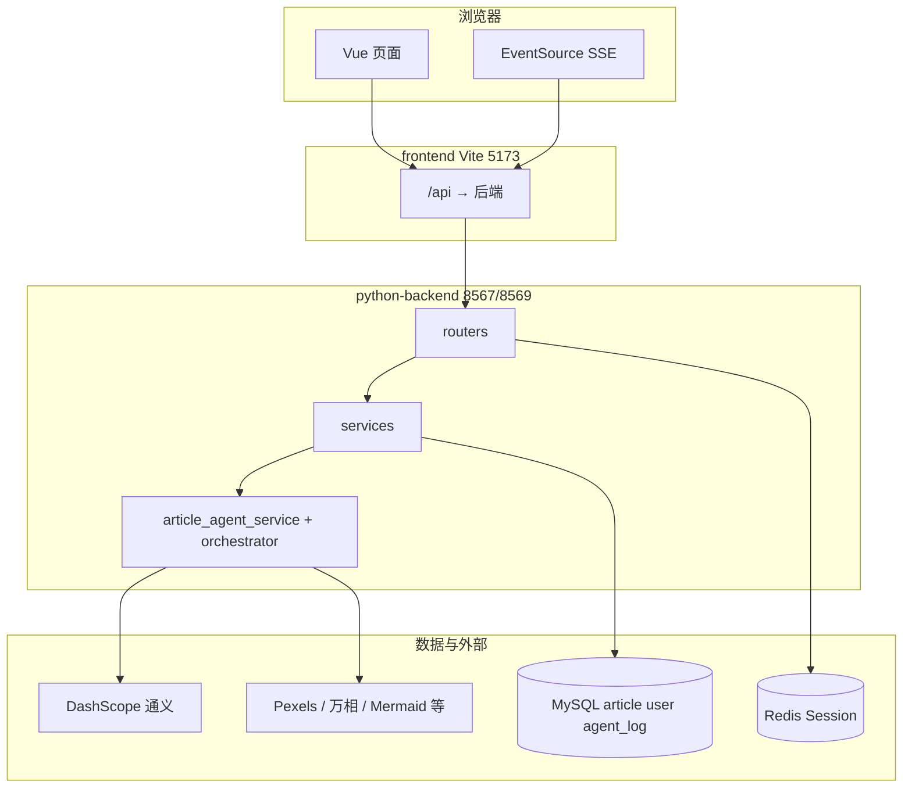

# AI 爆款文章创作器 — 从零开发手册

面向「想自己从零搭一遍 / 想搞懂本仓库怎么长出来的」的开发者。  
官方教程仓库：[yuyuanweb/ai-passage-creator](https://github.com/yuyuanweb/ai-passage-creator)（Java 主教程）；**本仓库是 Python 后端 + Vue 3 前端** 的实现与扩展。

---

## 目录

1. [项目是什么](#1-项目是什么)
2. [整体架构](#2-整体架构)
3. [环境准备（第 0 步）](#3-环境准备第-0-步)
4. [数据库从零初始化](#4-数据库从零初始化)
5. [后端从零跑起来](#5-后端从零跑起来)
6. [前端从零跑起来](#6-前端从零跑起来)
7. [功能是怎么分阶段做出来的](#7-功能是怎么分阶段做出来的)
8. [后端目录与分层（怎么加接口）](#8-后端目录与分层怎么加接口)
9. [前端目录与页面（怎么加页面）](#9-前端目录与页面怎么加页面)
10. [核心：多阶段 AI 创作流水线](#10-核心多阶段-ai-创作流水线)
11. [鉴权、Session、统一响应](#11-鉴权session统一响应)
12. [日常开发流程](#12-日常开发流程)
13. [常见问题排查](#13-常见问题排查)
14. [扩展开发示例](#14-扩展开发示例)
15. [相关文档索引](#15-相关文档索引)

---

## 1. 项目是什么

| 项目 | 说明 |
|------|------|
| 目标 | 用户输入选题 → 多智能体生成标题、大纲、正文、配图 → 导出 Markdown |
| 后端 | **FastAPI** + **MySQL**（业务数据）+ **Redis**（Session）+ **DashScope**（通义千问 / 万相） |
| 前端 | **Vue 3** + **Vite** + **Ant Design Vue** + **Pinia** |
| 对齐 | 编程导航「Spring AI + 多 Agent」课程；业务与官方 Java 版一致，技术栈为 Python |

仓库根目录：

```text
aicreate/
├── python-backend/     # API 服务
├── frontend/           # 浏览器页面
├── docs/               # 文档（含本手册）
├── reference-official/ # 官方源码对照（只读参考，勿当主工程改）
└── sql/                # 部分迁移脚本（主 SQL 在 python-backend/sql）
```

---

## 2. 整体架构



### 读图说明

图上从上到下是 **浏览器 → 前端 Vite → 后端 FastAPI → 数据与外部服务**。开发时你通常只打开 `http://localhost:5173`，不直接访问后端端口。

| 区域 | 含义 | 对应目录/技术 |
|------|------|----------------|
| **浏览器 · Vue 页面** | 登录、创作三栏、历史、详情等 | `frontend/src/pages/`；普通请求走 Axios |
| **浏览器 · EventSource SSE** | 创作进度长连接（标题/大纲/正文流式、配图进度） | `utils/sse.ts` → `GET /api/article/progress/{taskId}` |
| **frontend Vite 5173** | 开发服务器 + **`/api` 代理**到后端 | `frontend/vite.config.ts`；避免跨域、Cookie 随请求转发 |
| **routers** | HTTP 入口、鉴权、返回统一 JSON | `python-backend/app/routers/` |
| **services** | 业务：建任务、查改 `article`、列表分页 | `python-backend/app/services/` |
| **Agent + orchestrator** | 多阶段创作：通义生成、Reviewer、配图 | `article_agent_service.py`、`agent/orchestrator.py` |
| **MySQL** | 持久化：`user`、`article`、`agent_log` 等 | 见 §4 |
| **Redis** | 登录 Session（`SESSION` Cookie） | Router 校验登录，不经过 Agent |
| **DashScope / Pexels 等** | 大模型与配图外部 API | `.env` 中 `DASHSCOPE_*` 等 |

**箭头怎么读（以「开始创作」为例）：**

1. 页面 `POST /api/article/create` → Vite 代理 → **Router** → **Service** 建任务并启动阶段 1。
2. 同时 **SSE** 连 `progress/{taskId}`，同样经 Vite 到后端，持续收事件。
3. **Service** 调 **Agent**：写 **MySQL**、调 **通义**；配图阶段再调 **Pexels/万相/Mermaid** 等。
4. 任意 `/api` 请求前，**Router** 用 **Redis** 校验是否已登录。

**端口：** `5173`（或 Vite 提示的其它端口）是前端；`8567`/`8569` 是 uvicorn（Windows 上 8567 常被占用时可改用 8569，`frontend/.env.development` 的 `VITE_API_TARGET` 须与之一致）。

**开发时只访问前端地址**（如 `http://localhost:5173`），接口请求写 `/api/xxx`，由 Vite 代理到后端，Cookie 自动带上。更细的流水线与 SSE 事件见 §10；鉴权见 §11。

---

## 3. 环境准备（第 0 步）

下面按 **系统软件 → 项目依赖 → 配置与密钥 → 数据库脚本 → 可选组件** 列出本仓库本地开发需要准备的一切。路径以 `D:\agi_code\aicreate` 为例，请按你本机实际目录替换。

### 3.1 系统级软件（必装 / 二选一）

| 类别 | 软件 | 版本 | 是否必装 | 用途 |
|------|------|------|----------|------|
| 运行时 | **Node.js** | ≥ 20（见 `frontend/package.json` 的 `engines`） | **必装** | 跑前端 `npm install` / `npm run dev` |
| 运行时 | **Python** | ≥ 3.10（见 `pyproject.toml` 的 `requires-python`） | **必装** | 跑后端 FastAPI |
| 数据 | **MySQL** | 5.7 或 8.0 | **必装**（或用 Docker，见下） | `user`、`article`、`agent_log` 等 |
| 数据 | **Redis** | 6.x / 7.x 等稳定版 | **必装**（或用 Docker） | 登录 Session（`SESSION` Cookie） |
| 容器 | **Docker Desktop** | 最新稳定版 | 可选 | 用 `python-backend/docker-compose.yml` 一键起 MySQL+Redis |
| 包管理 | **Git** | 任意 | 可选 | 克隆仓库；本机已解压工程则可不装 |
| 包管理 | **uv** | 任意 | 可选 | 替代 `pip install -e .`，见 §3.3 方式 B |

**MySQL / Redis 的两种装法：**

1. **本机安装**：自己装 MySQL、Redis 服务，端口与 `python-backend/.env` 里 `DB_*`、`REDIS_*` 一致（默认 `3306`、`6379`）。
2. **Docker（推荐新手）**：在 `python-backend` 目录执行 `docker compose up -d`，会起 `mysql:8.0`（root 密码 `123456`）和 `redis:7-alpine`，与 `.env.example` 默认一致。

**不必安装的：**

- `reference-official/`：官方对照源码，**不参与运行**，不用在里面 `npm install`。
- 根目录 `sql/`：少量脚本；**主迁移脚本在** `python-backend/sql/`。

**开发工具（非运行必需）：** Cursor / VS Code、Navicat / DBeaver（看库）、Postman / Swagger（测 API）。

---

### 3.2 打开工程

```bat
cd /d D:\agi_code\aicreate
```

---

### 3.3 后端 Python 包（`pyproject.toml`）

本仓库**没有** `requirements.txt`，所有 Python 第三方库在 `python-backend/pyproject.toml` 的 `[project].dependencies` 中声明。

**安装命令（任选一种）：**

```bat
cd /d D:\agi_code\aicreate\python-backend
python -m venv .venv
.venv\Scripts\activate
pip install -e .
```

或使用 [uv](https://github.com/astral-sh/uv)：`uv sync`（会在项目内管理虚拟环境）。

**验证：** 激活 `.venv` 后执行 `python -c "import fastapi, sqlalchemy, redis"` 无报错即可。

| Python 包 | 主要用途 |
|-----------|----------|
| `fastapi` | Web 框架、路由、OpenAPI |
| `uvicorn[standard]` | ASGI 服务器（`uvicorn app.main:app`） |
| `python-multipart` | 表单 / 文件上传 |
| `sqlalchemy` + `pymysql` + `cryptography` | 连接 MySQL |
| `databases[mysql]` | 异步数据库访问（部分逻辑） |
| `redis` | Session 存储 |
| `pydantic` + `pydantic-settings` | 请求/响应模型、读 `.env` 配置 |
| `python-dotenv` | 加载环境变量 |
| `python-dateutil` | 日期处理 |
| `httpx` | HTTP 客户端（配图、外部 API） |
| `openai` | 调用通义等兼容 OpenAI 协议的大模型 API |
| `beautifulsoup4` + `lxml` | 解析 / 处理 HTML 正文 |
| `cos-python-sdk-v5` | 腾讯云 COS 上传配图（配了 COS 才用） |
| `google-genai` | Gemini 路线 AI 配图（`NANO_BANANA_PROVIDER=gemini`） |
| `stripe` | VIP 支付（不配 Key 则支付接口不可用） |

若目录里已有 `.venv` 且能启动后端，**不必重复建环境**；换机、报 `ModuleNotFoundError` 时再装。

---

### 3.4 前端 npm 包（`package.json`）

```bat
cd /d D:\agi_code\aicreate\frontend
npm install
```

会安装到 `frontend/node_modules/`（体积较大，**不要**提交到 Git）。

| 类型 | 包名 | 用途 |
|------|------|------|
| 生产依赖 | `vue`、`vue-router`、`pinia` | 页面、路由、状态 |
| 生产依赖 | `ant-design-vue` | UI 组件（表格、表单、布局） |
| 生产依赖 | `axios` | 请求 `/api` |
| 生产依赖 | `marked` | Markdown 预览 |
| 生产依赖 | `dayjs` | 时间格式化 |
| 生产依赖 | `sortablejs` | 大纲拖拽排序 |
| 开发依赖 | `vite`、`@vitejs/plugin-vue` | 开发服务器、打包 |
| 开发依赖 | `typescript`、`vue-tsc` | 类型检查 |
| 开发依赖 | **`sass-embedded`** | 创作页 **SCSS** 编译（缺了会报 Sass 相关错误） |
| 开发依赖 | `@umijs/openapi` | 可选：从 Swagger 生成 `src/api` 类型（`npm run openapi2ts`） |

**验证：** `npm run dev` 能打开 `http://localhost:5173`；登录页能显示。

---

### 3.5 配置文件（必做）

**后端：**

```bat
copy python-backend\.env.example python-backend\.env
```

**前端：** 已有 `frontend/.env.development`，确认 `VITE_API_TARGET` 与 uvicorn 端口一致：

```env
VITE_API_TARGET=http://127.0.0.1:8569
```

---

### 3.6 环境变量与外部服务（按功能分）

下面不是「安装软件」，而是要在 `.env` 里填的 **Key / 账号**。不配也能启动服务，但对应功能会降级或不可用。

#### 必配（多阶段 AI 创作 + 登录）

| 变量 | 说明 |
|------|------|
| `DB_HOST` / `DB_PORT` / `DB_NAME` / `DB_USER` / `DB_PASSWORD` | MySQL；库名默认 `ai_passage_creator` |
| `REDIS_HOST` / `REDIS_PORT` / `REDIS_DB` / `REDIS_PASSWORD` | Redis；本地常无密码 |
| `SESSION_SECRET_KEY` | Session 签名；**生产必须改成随机长串** |
| `PASSWORD_SALT` | 密码加盐（与建库脚本里测试账号一致即可） |
| **`DASHSCOPE_API_KEY`** | 阿里云百炼 / 通义 API Key；**标题、大纲、正文、Reviewer 都依赖它** |
| `DASHSCOPE_MODEL` 或 `LLM_MODEL` | 模型名，默认 `qwen-plus` / `qwen-turbo` |

#### 建议配（配图更完整）

| 变量 | 说明 | 不配时 |
|------|------|--------|
| `PEXELS_API_KEY` | Pexels 免费图库 | 无法用 Pexels 搜图 |
| `NANO_BANANA_PROVIDER` + Key | `gemini` 需 `NANO_BANANA_API_KEY`；`dashscope` 用万相（同一 `DASHSCOPE_API_KEY`） | AI 生图不可用或走另一路线 |
| `TENCENT_COS_*` | 腾讯云对象存储 | 配图可能只用本地/外链，视代码路径而定 |
| `MERMAID_ENABLE_REMOTE_FALLBACK` | 默认 `true`，用 Kroki 公网渲染流程图 | 关且未装本地 `mmdc` 时 Mermaid 配图失败 |

#### 可选（扩展功能）

| 变量 | 说明 |
|------|------|
| `AGENT_REVIEWER_ENABLED` / `AGENT_REVIEWER_PASS_SCORE` | 正文后审核智能体 |
| `AGENT_LLM_MAX_RETRIES` 等 | LLM 失败重试 |
| `STRIPE_API_KEY` / `STRIPE_WEBHOOK_SECRET` | VIP 支付 |
| `SERVER_PORT` | 默认 `8567`；Windows 冲突时常改 **8569** |

**通义 Key 获取：** 登录 [阿里云百炼](https://bailian.console.aliyun.com/) → 创建 API Key → 填入 `DASHSCOPE_API_KEY`。

---

### 3.7 数据库脚本（不是 pip/npm，但必须执行一次）

在 MySQL 中按顺序执行（详见 [§4](#4-数据库从零初始化)）：

| 顺序 | 文件 |
|------|------|
| 1 | `python-backend/sql/create_table.sql` |
| 2 | `python-backend/sql/passage_table.sql` |
| 3 | `python-backend/sql/migrate_article_agent_payment.sql` |
| 4 | `python-backend/sql/migrate_article_content_longtext.sql` |
| 5 | `python-backend/sql/patch_user_quota_vip.sql`（缺列时再执行） |

---

### 3.8 可选：本机 Mermaid CLI

配图阶段若需要 **本地** 渲染 Mermaid（不依赖 Kroki 外网），可全局安装：

```bat
npm install -g @mermaid-js/mermaid-cli
```

安装后命令行能执行 `mmdc`。未安装时，默认仍可用 `.env` 中的 **Kroki 远程渲染**（需能访问外网）。

---

### 3.9 推荐安装顺序（核对清单）

按顺序打勾，避免漏步：

- [ ] 安装 **Node.js 20+**、**Python 3.10+**
- [ ] 启动 **MySQL + Redis**（本机或 `docker compose up -d`）
- [ ] `cd python-backend` → `python -m venv .venv` → `activate` → **`pip install -e .`**
- [ ] `copy .env.example .env` → 填 **DB_***、**REDIS_***、**DASHSCOPE_API_KEY***
- [ ] 在 MySQL 执行 **§4** 的 SQL 脚本
- [ ] `cd frontend` → **`npm install`**
- [ ] 确认 **`frontend/.env.development`** 的 `VITE_API_TARGET` 与后端端口一致
- [ ] 启动后端：`python -m uvicorn app.main:app --host 0.0.0.0 --port 8569`（创作时勿加 `--reload`）
- [ ] 启动前端：`npm run dev`
- [ ] 浏览器登录 **admin / 12345678**，试一次创作

**最小可跑通登录 + 列表：** MySQL、Redis、`.env` 数据库项、SQL 脚本、前后端依赖。  
**最小可跑通多阶段创作：** 以上 + **`DASHSCOPE_API_KEY`**。  
**配图齐全：** 再配 Pexels / 万相或 Gemini / COS / Mermaid（本地或 Kroki）。

---

## 4. 数据库从零初始化

库名默认：**`ai_passage_creator`**。

### 4.1 执行顺序（新库按顺序执行一次）

| 顺序 | 脚本 | 作用 |
|------|------|------|
| 1 | `python-backend/sql/create_table.sql` | 建库 + `user` 表 + 测试账号 admin/user |
| 2 | `python-backend/sql/passage_table.sql` | 简易文章表 `passage`（教程早期） |
| 3 | `python-backend/sql/migrate_article_agent_payment.sql` | **`article`**、**`agent_log`**、`payment_record` 等 |
| 4 | `python-backend/sql/migrate_article_content_longtext.sql` | 正文/全文 LONGTEXT（长文必做） |
| 5 | `python-backend/sql/patch_user_quota_vip.sql` | 若 user 表尚无 `quota`/`vipTime` 再执行 |

在 MySQL 客户端中：

```sql
SOURCE D:/agi_code/aicreate/python-backend/sql/create_table.sql;
-- 依次 SOURCE 其他脚本…
```

某列已存在会报 `Duplicate column`，跳过该行即可。

### 4.2 核心表说明

| 表 | 用途 |
|----|------|
| `user` | 账号、角色 user/admin/vip、配额 quota |
| `passage` | 简易「单次生成」文章（`/passage/*`） |
| `article` | **多阶段创作**任务：phase、status、content、fullContent |
| `agent_log` | 每个智能体执行记录（排查卡在哪一步） |
| `payment_record` | Stripe 支付（可选） |

### 4.3 测试账号（create_table.sql 自带）

| 账号 | 密码 | 角色 |
|------|------|------|
| admin | 12345678 | 管理员 |
| user | 12345678 | 普通用户 |

---

## 5. 后端从零跑起来

```bat
cd /d D:\agi_code\aicreate\python-backend
python -m uvicorn app.main:app --host 0.0.0.0 --port 8569
```

验证：

- 浏览器打开 `http://127.0.0.1:8569/api/health` → `code: 0`
- 打开 `http://127.0.0.1:8569/docs` → Swagger

**重要（多阶段创作）：**

- 创作任务在后台跑 **asyncio 长任务**，不要用 `--reload`，否则热重载会杀掉任务。
- Windows 若 `8567` 端口「幽灵占用」，改用 **8569** 并同步改前端 `VITE_API_TARGET`。

### 5.1 后端入口挂载了哪些路由

| 前缀 | 文件 | 说明 |
|------|------|------|
| `/api` | `health.py` | 健康检查 |
| `/api/user` | `user.py` | 注册登录、用户管理 |
| `/api/passage` | `passage.py` | 简易创作 + SSE demo |
| `/api/article` | `article.py` | **多阶段创作 + SSE 进度** |
| `/api/statistics` | `statistics.py` | 运营统计（admin） |
| `/api/payment` | `payment.py` | 支付（可选） |

---

## 6. 前端从零跑起来

```bat
cd /d D:\agi_code\aicreate\frontend
npm run dev
```

浏览器打开终端里的 **Local**（通常 `http://localhost:5173`）。

### 6.1 页面路由一览

| 路径 | 页面 | 登录 |
|------|------|------|
| `/` | 首页 | 否 |
| `/user/login`、`/user/register` | 登录注册 | 否 |
| `/article/create` | **三栏创作页**（官方 UI） | 是 |
| `/article/list` | 创作历史 | 是 |
| `/article/:taskId` | 文章详情 + 执行日志 + 导出 | 是 |
| `/passage/create`、`/passage/my` | 简易创作（早期） | 是 |
| `/admin/userManage` | 用户管理 | admin |
| `/admin/statistics` | 数据分析 | admin |

路由定义：`frontend/src/router/index.ts`  
路由守卫：`frontend/src/access.ts`（未登录、`/admin` 权限）

---

## 7. 功能是怎么分阶段做出来的

建议按下面顺序理解「从零到现状」，与教程期数大致对应。

### 阶段 A：基础全栈（用户模块）

| 做了什么 | 后端 | 前端 |
|----------|------|------|
| 注册 / 登录 / Session | `user.py` + Redis `session:{uuid}` | `UserLoginPage`、`loginUser` store |
| 统一响应 `{code,data,message}` | `schemas/common.py` | `request.ts` 拦截器 |
| 路由守卫 | `deps.py` `require_login` | `access.ts` |
| 管理员用户列表 | `user.py` list/add/... | `UserManagePage` |

### 阶段 B：简易创作（passage）

| 做了什么 | 说明 |
|----------|------|
| `passage` 表 + CRUD | 一次生成一篇占位/LLM 短文 |
| SSE 入门 demo | `GET /api/passage/stream/demo` |

适合理解 SSE，**主流程请用 article**。

### 阶段 C：AI 核心创作后端（article + 多 Agent）

| 做了什么 | 关键文件 |
|----------|----------|
| `article` 表 + phase 状态机 | `article_service.py`、`enums.py` |
| 智能体 1～6 + Reviewer | `article_agent_service.py`、`constants/prompt.py` |
| 编排 | `agent/orchestrator.py` |
| 异步阶段 1/2/3 | `article_async_service.py` |
| SSE 推送 + 消息缓冲 | `managers/sse_manager.py`、`routers/article.py` |
| 配图策略 | Pexels、Mermaid、万相、Iconify 等 |
| 执行日志 | `agent_log` 表 + `agent_log_service.py` |
| LLM 重试与 JSON 解析 | `utils/llm_retry.py` |

### 阶段 D：AI 核心创作前端

| 做了什么 | 关键文件 |
|----------|----------|
| 三栏创作 UI（对齐官方） | `pages/article/ArticleCreatePage.vue` |
| 选标题 / 编大纲组件 | `components/TitleSelectingStage.vue`、`OutlineEditingStage.vue` |
| SSE 客户端 | `utils/sse.ts` |
| 创作历史 / 详情 / 导出 | `ArticleListPage.vue`、`ArticleDetailPage.vue` |
| API 封装 | `api/article.ts` |

### 阶段 E：运营与扩展

| 做了什么 | 说明 |
|----------|------|
| 数据分析 | `statistics_service.py` + `StatisticsPage.vue` |
| Prompt 优化 | `constants/prompt.py` |
| 示例：今日失败数 | `StatisticsVO.todayFailedCount` |

---

## 8. 后端目录与分层（怎么加接口）

```text
python-backend/app/
├── main.py              # 入口、CORS、异常、挂载路由
├── config.py            # .env → settings
├── database.py          # MySQL 连接池
├── deps.py              # require_login / require_admin
├── exceptions.py        # 业务错误码
├── routers/             # HTTP 层：参数校验、调 service、返回 BaseResponse
├── services/            # 业务逻辑、SQL、调 LLM
├── schemas/             # Pydantic 请求/响应（VO）
├── models/              # 表结构 / 枚举
├── constants/           # Prompt 等常量
├── utils/               # llm、session、llm_retry
├── managers/            # SSE 连接管理
└── agent/               # 多智能体编排
```

**加一个新接口的标准步骤：**

1. `schemas/` 定义 `XxxRequest`、`XxxVO`
2. `services/xxx_service.py` 写业务（`await db.execute(...)`）
3. `routers/xxx.py` 写 `@router.post`，`Depends(require_login)`
4. `routers/__init__.py` 导出，`main.py` 里 `include_router`（若新模块）
5. 打开 `/docs` 自测

---

## 9. 前端目录与页面（怎么加页面）

```text
frontend/src/
├── main.ts              # Pinia、Router、Ant Design、全局 CSS
├── access.ts            # 路由守卫
├── request.ts           # Axios baseURL=/api、Cookie
├── router/index.ts      # 路由表
├── layouts/BasicLayout.vue
├── components/GlobalHeader.vue
├── stores/loginUser.ts
├── api/                 # 按模块封装接口
├── types/               # TS 类型
├── utils/               # sse、article 导出、permission
└── pages/
    ├── article/         # 多阶段创作
    ├── passage/         # 简易创作
    ├── user/
    └── admin/
```

**加一个新页面：**

1. `pages/xxx/XxxPage.vue`
2. `router/index.ts` 增加 `path`、`meta.requiresAuth` 等
3. 需要菜单则在 `GlobalHeader.vue` 加 `RouterLink`
4. 调接口用 `api/xxx.ts` 或 `request`，不要写死后端端口

创作页全屏三栏：`meta: { fullBleed: true }`，`BasicLayout` 会去掉 max-width 和 footer。

---

## 10. 核心：多阶段 AI 创作流水线

### 10.1 用户视角步骤

```text
输入选题 → 开始创作
  → 阶段1：生成标题方案 → 用户选标题 + 可选补充说明
  → 阶段2：生成大纲（流式）→ 用户编辑/确认大纲
  → 阶段3：正文（流式）→ Reviewer 审核 → 配图分析 → 生成配图 → 合并全文
  → 完成：可查看详情、导出 Markdown
```

### 10.2 后端 phase 与接口

| phase（article 表） | 用户动作 | 主要接口 |
|---------------------|----------|----------|
| `PENDING` → `TITLE_GENERATING` | 开始创作 | `POST /api/article/create` |
| `TITLE_SELECTING` | 选标题 | `POST /api/article/confirm-title` |
| `OUTLINE_GENERATING` → `OUTLINE_EDITING` | 等大纲 / 改大纲 | SSE + `POST /api/article/confirm-outline` |
| `CONTENT_GENERATING` | 等正文与配图 | SSE；卡住可 `POST /api/article/{taskId}/resume?force=true` |
| 完成 | `status=COMPLETED` | `GET /api/article/{taskId}` |

**SSE：** `GET /api/article/progress/{taskId}`（`EventSource`，前端 `utils/sse.ts`）

常见 SSE 类型：`TITLES_GENERATED`、`AGENT2_STREAMING`、`OUTLINE_GENERATED`、`AGENT3_STREAMING`、`AGENT_REVIEWER_COMPLETE`、`IMAGE_COMPLETE`、`MERGE_COMPLETE`、`ALL_COMPLETE`、`ERROR`。

### 10.3 前端与后端协作要点（本项目踩坑总结）

| 要点 | 说明 |
|------|------|
| 先连 SSE 再 confirm | 确认标题/大纲前 `ensureSSE`，避免消息丢失 |
| 轮询兜底 | 每 8s `GET /api/article/{taskId}` 同步 phase（SSE 断线时） |
| 不要用 reload | 后端长任务会被杀 |
| 前后端端口一致 | `VITE_API_TARGET` = uvicorn `--port` |
| 正文在 COMPLETED 前 | 轮询里常无 content，靠 SSE 流式 |
| 排查卡死 | 查 MySQL `agent_log` 或详情页「执行日志」 |

### 10.4 agent_log 与智能体对应

| agentName | 含义 |
|-----------|------|
| agent1_generate_titles | 标题 |
| agent2_generate_outline | 大纲 |
| agent3_generate_content | 正文 |
| agent_reviewer_review_content | 审核 |
| agent4_analyze_image_requirements | 配图需求 |
| agent5_generate_images | 配图 |
| agent6_merge_content | 合并 |

---

## 11. 鉴权、Session、统一响应

### 11.1 登录流程

1. `POST /api/user/login` → 后端写 Redis `session:{uuid}`，Set-Cookie `SESSION=uuid`
2. 前端 `withCredentials: true` 之后请求都带 Cookie
3. `GET /api/user/get/login` 恢复登录态

### 11.2 依赖注入

```python
# deps.py
require_login   # 未登录 → code 40100
require_admin   # 非 admin → code 40101
```

### 11.3 统一响应

成功：`{ "code": 0, "data": {...}, "message": "ok" }`  
失败：HTTP 仍多为 200，`code != 0`（如 40100）

前端判断：`if (data.code !== 0) throw ...`（见 `api/article.ts` 的 `assertOk`）

---

## 12. 日常开发流程

### 12.1 每天开工（两个终端）

**终端 1 — 后端：**

```bat
cd /d D:\agi_code\aicreate\python-backend
python -m uvicorn app.main:app --host 0.0.0.0 --port 8569
```

**终端 2 — 前端：**

```bat
cd /d D:\agi_code\aicreate\frontend
npm run dev
```

### 12.2 建议自测顺序

1. `admin` / `12345678` 登录  
2. `/article/create` 完整走一遍创作  
3. `/article/list` 查看、导出、删除  
4. `/article/{taskId}` 看执行日志  
5. `/admin/statistics` 看统计（admin）

### 12.3 改代码后

| 改了什么 | 要做什么 |
|----------|----------|
| Python | 重启 uvicorn |
| Vue / TS | 保存后 Vite 热更新，偶发需刷新浏览器 |
| `.env` | 重启后端；前端改 `.env.development` 后重启 `npm run dev` |
| SQL 迁移 | 在 MySQL 执行脚本后重启后端 |

---

## 13. 常见问题排查

| 现象 | 可能原因 | 处理 |
|------|----------|------|
| 前端接口全红 ECONNREFUSED | 后端没起或端口不对 | 查 `VITE_API_TARGET` 与 uvicorn `--port` |
| WinError 10048 | 重复启动 uvicorn | 只保留一个进程；或换 8569 |
| 创作卡在「生成大纲/正文」 | reload 杀了任务 / SSE 未连 | 不用 reload；刷新后点「继续生成」 |
| Swagger 无 todayFailedCount | 旧进程 | 重启后端；Redis `DEL statistics:overview:v2` |
| agent_log 无 agent3 | 阶段3 未真正启动 | `POST .../resume?force=true` |
| 配图失败 / 429 | 万相 QPS 低 | 少勾 AI 图；看后端日志 |
| 页面 SCSS 报错 | 缺 sass | `npm i -D sass-embedded` |
| 删除按钮溢出白底 | 表格太宽 | 已用横向滚动 + 固定操作列（`ArticleListPage`） |

更短命令清单见：[前端命令手册.md](./前端命令手册.md)

---

## 14. 扩展开发示例

### 14.1 新增一个统计指标（已做过：今日失败数）

1. Navicat 验证 SQL  
2. `schemas/statistics.py` → `StatisticsVO` 加字段  
3. `statistics_service.py` 加查询方法并在 `get_statistics` 里赋值  
4. 缓存 key 改为 `statistics:overview:v3`（或删 Redis 旧 key）  
5. `frontend/src/api/statistics.ts` 类型 + `StatisticsPage.vue` 卡片  

### 14.2 新增一个需登录的 API

1. `routers/article.py` 或新 router  
2. `services` 写逻辑  
3. `frontend/src/api/article.ts` 封装  
4. 页面调用  

### 14.3 对照官方改 UI

参考目录：`reference-official/frontend/src/pages/article/`  
当前主创作页：`frontend/src/pages/article/ArticleCreatePage.vue`（已三栏，逻辑保留 SSE/轮询/resume）

---

## 15. 相关文档索引

| 文档 | 适合什么时候看 |
|------|----------------|
| [前端命令手册.md](./前端命令手册.md) | 复制命令、端口、npm |
| [项目功能与开发流程（新手向）.md](./项目功能与开发流程（新手向）.md) | 功能清单（部分 passage 描述，以 article 为准） |
| [前后端联调与实现技术总结.md](./前后端联调与实现技术总结.md) | Cookie、代理、Depends 细节 |
| [教程对齐-第3期AI核心创作-Python版学习路线.md](./教程对齐-第3期AI核心创作-Python版学习路线.md) | 与官方课程章节对照 |
| [官方源码对照-第二节AI创作后端学习路径.md](./官方源码对照-第二节AI创作后端学习路径.md) | 读官方 Java 前的导读 |

---

## 附录：最小「从零检查清单」

- [ ] MySQL、Redis 已启动  
- [ ] SQL 脚本按顺序执行完  
- [ ] `python-backend/.env` 已配置，`DASHSCOPE_API_KEY` 有效  
- [ ] `frontend/.env.development` 端口与后端一致  
- [ ] `uvicorn` 已启动，`/api/health` 正常  
- [ ] `npm run dev` 已启动，能登录 admin  
- [ ] `/article/create` 能完整跑通一篇  
- [ ] `agent_log` 表有对应记录（可选验证）  

全部打勾，说明你已经具备与本仓库一致的开发与排错能力。

---

*文档随仓库实现更新；若与代码不一致，以 `python-backend` / `frontend` 源码为准。*
