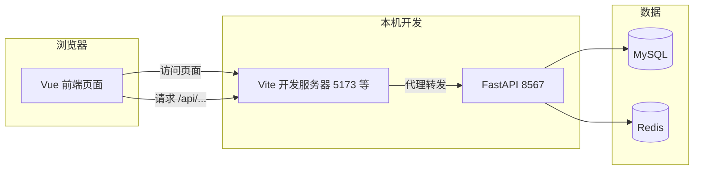

# 项目功能与开发流程（新手向）

面向第一次接触本仓库的同学：先知道**已经有什么**，再知道**日常怎么跑**、**前后端怎么配合**，最后知道**想加功能时该动哪里**。

> **想从零搭一遍？** 请看 **[从零开发手册.md](./从零开发手册.md)**（环境、数据库、前后端、多 Agent 流水线、排错与扩展）。

---

## 一、项目是干什么的

这是一个 **「AI 爆款文章创作器」** 的全栈练习项目：前端用 **Vue 3**，后端用 **FastAPI（Python）**，对齐编程导航教程思路（原教程偏 Spring，本仓库是 **Python 版**）。

当前已实现：

- **用户体系**：注册、登录、登出、Session（Cookie + Redis）、按角色鉴权。
- **管理端**：管理员分页查看用户列表。
- **创作流程（骨架）**：登录用户可「生成文章」并入库；正文目前是**占位文案**，预留以后接大模型 / 多 Agent。
- **首页**：教程风格的三卡片欢迎页 + 欢迎使用区。

---

## 二、仓库里两大块分别干什么

| 目录 | 技术 | 作用（一句话） |
|------|------|----------------|
| `python-backend/` | FastAPI + MySQL + Redis | 提供 **API**（JSON），存用户与文章，管登录会话 |
| `frontend/` | Vue 3 + Vite + Ant Design Vue | **浏览器里看到的页面**，通过 HTTP 调后端 |

关系可以记成：



- 开发时：你只在浏览器里打开 **前端地址**（如 `http://localhost:5173`）。
- 页面里请求写的是 **`/api/...`**，由 **Vite** 转到 **8567** 的后端，这样不用在代码里写死 `http://127.0.0.1:8567`（见 `frontend/vite.config.ts`）。

---

## 三、已经开发的功能清单

### 后端（`python-backend`）

| 能力 | 说明 | 典型路径（都在 `/api` 下） |
|------|------|---------------------------|
| 健康检查 | 判断服务是否活着 | `GET /api/health` |
| 用户注册 | 账号 ≥4 位，密码 ≥8 位 | `POST /api/user/register` |
| 用户登录 | 成功后写 **SESSION** Cookie，Redis 存会话 | `POST /api/user/login` |
| 用户登出 | 清 Cookie、删 Redis 会话 | `POST /api/user/logout` |
| 当前登录用户 | 需带 Cookie | `GET /api/user/get/login` |
| 按 id 查用户 | 公开查询（按你们业务设计使用） | `GET /api/user/get?id=` |
| 用户分页列表 | **仅管理员** | `POST /api/user/list/page` |
| 管理员增删改用户 | 需管理员 | `POST /api/user/add` 等 |
| 文章生成（占位） | **需登录**；写入 `passage` 表 | `POST /api/passage/generate` |
| 我的文章列表 | **需登录**；分页 | `GET /api/passage/list` |
| 文章详情 | **需登录**；只能看自己的 | `GET /api/passage/get?id=` |

统一约定：业务成功时响应里 **`code === 0`**，数据在 **`data`**，说明在 **`message`**。未登录等业务错误也是 HTTP 200 + 非 0 的 `code`（如 `40100`）。

数据库脚本：

- [`sql/create_table.sql`](../python-backend/sql/create_table.sql)：用户表等初始化。
- [`sql/passage_table.sql`](../python-backend/sql/passage_table.sql)：**文章表**（若要做创作功能，需执行过）。

配置：复制 [`python-backend/.env.example`](../python-backend/.env.example) 为 `.env`，填 MySQL、Redis、密钥等。

---

### 前端（`frontend`）

| 页面 / 能力 | 路径 | 说明 |
|-------------|------|------|
| 首页（欢迎 + 三卡片） | `/` | 教程风格入口；未登录引导登录/注册 |
| 关于 | `/about` | 简短说明 |
| 登录 | `/user/login` | 独立全屏页 |
| 注册 | `/user/register` | 独立全屏页 |
| 用户管理 | `/admin/userManage` | **仅 admin**；表格 + 分页 |
| AI 创作 | `/passage/create` | **需登录**；标题 + 主题，调用生成接口 |
| 我的文章 | `/passage/my` | **需登录**；列表 + 查看正文 |

其它机制：

- **顶栏**：首页/关于；登录后显示昵称、角色、退出；管理员多「用户管理」；登录后还有「AI 创作」「我的文章」。
- **Pinia `loginUser`**：存当前用户；刷新后会再请求 `/user/get/login`。
- **路由守卫** [`src/access.ts`](../frontend/src/access.ts)：首次进入先拉登录态；`/admin` 开头需管理员；带 `requiresAuth` 的路由未登录会跳登录页。
- **Axios** [`src/request.ts`](../frontend/src/request.ts)：`baseURL: '/api'`，`withCredentials: true` 带 Cookie；`40100` 时跳转登录。

---

## 四、新手日常开发流程（从开机到能改代码）

### 第 0 步：环境（只做一次）

- **Node.js** ≥ 20（跑前端 `npm`）。
- **Python** ≥ 3.10（跑后端）。
- **MySQL、Redis** 安装并能在本机连接。
- 可选：**uv**（装 Python 依赖快）或只用 **pip + venv**。

详细命令见：[前端命令手册.md](./前端命令手册.md)。

---

### 第 1 步：准备数据库（有变更时做）

1. 建库、用户表：执行 `python-backend/sql/create_table.sql`（按你库名调整）。
2. 若要用创作功能：再执行 `python-backend/sql/passage_table.sql`。

---

### 第 2 步：启动后端（开发时保持一个终端不关）

```bat
cd /d D:\agi_code\aicreate\python-backend
python -m uvicorn app.main:app --reload --host 0.0.0.0 --port 8567
```

浏览器打开 **接口文档**：http://localhost:8567/docs  

看到接口列表、且终端无报错，说明后端基本正常。

---

### 第 3 步：启动前端（再开一个终端）

```bat
cd /d D:\agi_code\aicreate\frontend
npm install
npm run dev
```

终端里会打印 **Local** 地址（如 `http://localhost:5173`），用浏览器打开。

---

### 第 4 步：联调自测（建议顺序）

1. **注册** → `/user/register`（账号 ≥4、密码 ≥8）。
2. **登录** → 顶栏出现昵称；首页「欢迎使用」变为已登录样式。
3. **AI 创作** → 填标题和主题 → 生成成功（占位正文）。
4. **我的文章** → 能看到刚生成的记录。
5. **管理员**：用 SQL 里初始化的 `admin` 账号登录（或把某用户 `userRole` 改为 `admin` 后重新登录）→ **用户管理**、访问 `/admin/userManage`。

---

## 五、想加新功能时，该改哪里（心智模型）

### 要加「新接口」（例如新表、新业务）

1. **数据库**：写 SQL 或在迁移里加表/字段。  
2. **后端**：在 `python-backend/app/` 里按现有风格加：
   - `schemas/`：请求/响应结构（Pydantic）
   - `services/`：业务逻辑、查库
   - `routers/`：路由函数，挂到 `main.py` 的 `include_router`
3. **自测**：在 `/docs` 里点「Try it out」。
4. **前端**：在对应页面用 `request.get/post/...` 调新路径；需要类型可跑 `npm run openapi2ts`（需先启动后端）。

### 要加「新页面」

1. 在 `frontend/src/pages/` 下新建 `.vue`。  
2. 在 `frontend/src/router/index.ts` 里加 `path` 和 `component`；若需登录，加 `meta: { requiresAuth: true }`。  
3. 若需进顶栏菜单，改 `GlobalHeader.vue`。

### 前后端「对合同」的三件事

1. **URL**：前端写的是 **`/api` 后面的路径**（如 `/user/login`），因为 `baseURL` 已是 `/api`。  
2. **字段名**：后端 Pydantic 用了 **驼峰 alias** 的，JSON 里也用驼峰（如 `userAccount`）。  
3. **登录态**：需要登录的接口，浏览器必须带上 **Cookie**（前端已 `withCredentials: true`）。

---

## 六、重要文件速查（记不住时翻这里）

| 用途 | 路径 |
|------|------|
| 后端入口、CORS、挂路由 | `python-backend/app/main.py` |
| 用户接口 | `python-backend/app/routers/user.py` |
| 文章接口 | `python-backend/app/routers/passage.py` |
| 前端路由 | `frontend/src/router/index.ts` |
| 全局请求、401 处理 | `frontend/src/request.ts` |
| 路由守卫 | `frontend/src/access.ts` |
| 登录用户状态 | `frontend/src/stores/loginUser.ts` |

---

## 七、和教程文档的关系

- 教程原文偏 **Spring Boot**；本仓库是 **FastAPI**，接口路径、OpenAPI 地址与 Java 版可能略有不同，但 **「用户模块 + 创作流程」的分层思路**一致：先跑通用户与鉴权，再在 Service 里接 AI。
- 更细的环境与命令：[前端命令手册.md](./前端命令手册.md)、[前端环境与教程实践-技术讲解.md](./前端环境与教程实践-技术讲解.md)。

---

## 八、还没做、以后可接的部分

- **真实 AI 生成**：替换后端 `passage_service` 里占位生成函数，接入模型 API 或多 Agent 编排。
- **流式输出、历史版本、支付等**：按教程后续章节逐步加。

---

*文档随项目迭代可继续补充；有具体报错可把终端或 Network 里的响应贴出来排查。*
